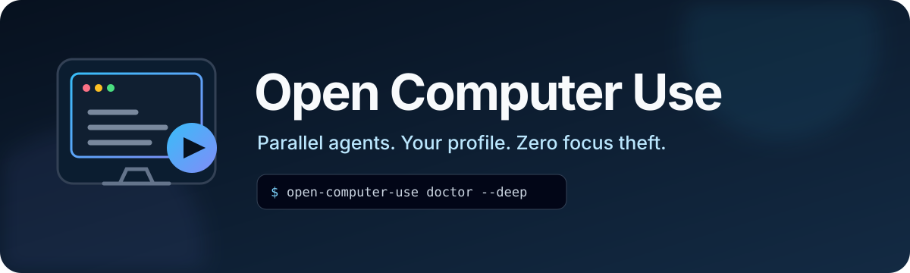
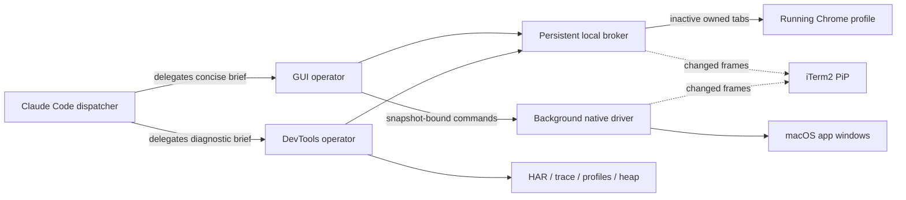

<p align="center">
  
</p>

<p align="center">
  Background browser and native macOS automation for Claude Code.<br>
  Parallel agents. Your Chrome profile. No stolen focus. Live iTerm2 preview.
</p>

<p align="center">
  <a href="https://github.com/anpu-ai-official/open-computer-use/actions/workflows/ci.yml"></a>
  <a href="LICENSE"></a>
  
  
</p>

> [!IMPORTANT]
> Open Computer Use is in public preview. The source and release pipeline are ready; the one-line installer becomes available with the first Developer ID-signed and notarized GitHub release. See [Installation](docs/installation.md) for the current options.

## Why it exists

GUI agents are useful, but foreground automation interrupts typing, one browser per worker wastes memory and loses your sessions, and raw screenshots quickly consume the parent agent's context. Open Computer Use takes a different approach:

- **Actually backgrounded.** Browser tabs are created inactive in your already-running Chrome profile. Native input is routed to an exact PID and window without activating it.
- **Parallel by design.** A persistent local broker multiplexes isolated sessions so Claude Code subagents can work concurrently.
- **Context-efficient.** Operators receive the detailed accessibility, network, trace, and screenshot data. The dispatcher gets concise findings and file-backed artifacts.
- **Expert browser diagnostics.** Network/HAR, Console, Application storage, Web Vitals, CPU profiles, JS/CSS coverage, traces, heap snapshots, and throttling are exposed on the owned tab.
- **Visible when you want it.** A minimizable picture-in-picture pane inside the originating iTerm2 tab shows deduplicated frames without sending them to the model.
- **Self-contained releases.** The archive bundles the runtime, patched native driver, Node.js, Playwright library, Claude skill, operators, preview, and doctor.

## Quick start

Supported today: Apple-silicon Mac, macOS 13+, Claude Code CLI, iTerm2 in `/Applications`, and Google Chrome in `/Applications`.

Once a signed release is published:

```bash
/bin/bash -c "$(curl -fsSL https://raw.githubusercontent.com/anpu-ai-official/open-computer-use/main/install.sh)"
open-computer-use permissions
open-computer-use doctor --deep
```

The installer is per-user and does not need `sudo`. macOS still requires the logged-in user to approve Accessibility, Screen Recording, and sometimes iTerm2 Automation; root cannot silently grant those permissions.

Then ask Claude Code naturally:

```text
Use computer-use to compare these three authenticated dashboards in parallel,
leave my current Chrome tab and foreground app untouched, and show the shared preview.
```

For browser diagnostics:

```text
Use computer-use to profile this page in an inactive Chrome tab. Find the slow
requests and hottest JavaScript functions, save the trace, and summarize fixes.
```

## How it works



The browser broker listens only on `127.0.0.1`. Each agent owns only the tabs it creates; tab teardown and diagnostic cleanup are part of the session lifecycle. The native driver uses fresh accessibility snapshots and exact window targets. Read the [architecture](docs/architecture.md) and [privacy model](docs/privacy-and-security.md) for details.

## Commands

```text
open-computer-use setup
open-computer-use doctor [--deep | --repair | --bundle-only]
open-computer-use permissions
open-computer-use warm-browser
open-computer-use start | stop | restart | status
open-computer-use preview <start|minimize|restore|status|close|...>
open-computer-use driver <driver command ...>
open-computer-use uninstall
```

`ocu` is a short alias. `doctor --repair` repeats safe setup steps; `doctor --deep` opens and closes one inactive Chrome tab, checks the native driver, and probes iTerm2. These checks are local and make no model calls.

## Capability and boundaries

| Area | What works | Deliberate boundary |
|---|---|---|
| Chrome | Inactive new tabs in the existing profile, inherited cookies/logins/extensions, parallel sessions | Does not take control of tabs the user already had open |
| Native macOS | AX inspection, exact-window actions, routed text/keys, screenshots, verification | Background delivery can be rejected across macOS Spaces |
| DevTools | Network, storage, console, issues, Web Vitals, CPU, coverage, trace, heap, emulation | Target-owned diagnostics; no visible DevTools UI required |
| Preview | Shared changed-frame PiP, pause/minimize/restore, terminal-safe capture | One shared latest-channel view in v0.1; no mosaic yet |
| Browsers/platforms | Chrome on Apple-silicon macOS | Safari, Firefox, Intel Mac, Windows, and Linux are not yet supported |

Browser tabs share the state of the chosen Chrome profile. That is a feature for authenticated work, not clean-room isolation. Use a dedicated Chrome profile when account separation matters.

## Quality bar

The checked 0.1.0 development build passed isolated installation, Homebrew installation, parallel browser sessions, focus monitoring, teardown and rollback, Network/Application/Console diagnostics, Web Vitals, CPU and coverage profiling, tracing, heap capture, native background actions, and non-flickering iTerm preview tests. Full results and the remaining public-signing gate are in [TESTING.md](TESTING.md).

```bash
make check
make test
```

## Project docs

- [Installation and upgrades](docs/installation.md)
- [Architecture](docs/architecture.md)
- [Permissions](docs/permissions.md)
- [Troubleshooting](docs/troubleshooting.md)
- [Development and testing](docs/development.md)
- [Release process](docs/releasing.md)
- [Privacy and security](docs/privacy-and-security.md)
- [Roadmap](ROADMAP.md)

## Contributing

Issues and pull requests are welcome. Start with [CONTRIBUTING.md](CONTRIBUTING.md), read the [Code of Conduct](CODE_OF_CONDUCT.md), and report vulnerabilities privately as described in [SECURITY.md](SECURITY.md).

Open Computer Use is MIT licensed. It builds on the upstream Cua driver; attribution and bundled dependency licenses are documented in [THIRD_PARTY_NOTICES.md](THIRD_PARTY_NOTICES.md). This project is independent and is not affiliated with Anthropic, Apple, Google, Microsoft, OpenAI, or Cua AI.
